# A. Hook {background-color="#1b9e77"}

## The 30-second pitch

::: {.columns}

::: {.column}

How can we prepare for the unknown?

Is computer vision a solved problem?

How can we save time with new tech?

:::

::: {.column}


:::

:::


::: {.notes}
The goal of today's talk is to help us think about preparing for a project when we don't have all of the information that we need from the client.

For AQ Group one of the tasks that we could work on was rolled-metal defect detection. This is a problem that has been worked on for decades, and there are many classical computer vision techniques that can be used to solve it. However, there are also new vision-language models that have been shown to be very effective at a wide range of computer vision tasks.

So the question is, how can we use this new technology to save time and resources on a project like this? And how can we prepare for the unknowns that we might encounter along the way?
:::

## What I want you to take away from today's talk

```{=html}
<style>
.cv-compare {
  display: flex;
  align-items: stretch;
  gap: 0;
  width: 100%;
  max-width: 1460px;
  margin: 0 auto;
  font-family: -apple-system, BlinkMacSystemFont, "Segoe UI", Roboto, sans-serif;
  height: 670px;
}
.cv-compare * { box-sizing: border-box; }

/* ── left / right panels ── */
.cv-panel {
  flex: 1;
  display: flex;
  flex-direction: column;
  border-radius: 16px;
  padding: 20px 28px 16px;
  gap: 12px;
}
.cv-panel.classical {
  background: #eaf7f3;
  border: 2.5px solid #1b9e77;
  margin-right: 12px;
}
.cv-panel.vlm {
  background: #fff4ec;
  border: 2.5px solid #d95f02;
  margin-left: 12px;
}

.cv-panel-title {
  font-size: 1.85rem;
  font-weight: 800;
  letter-spacing: 0.4px;
  margin: 0 0 4px;
}
.cv-panel.classical .cv-panel-title { color: #1b9e77; }
.cv-panel.vlm       .cv-panel-title { color: #d95f02; }

.cv-panel-subtitle {
  font-size: 1.05rem;
  color: #64748b;
  margin: 0 0 10px;
  font-style: italic;
}

/* ── trait rows ── */
.cv-trait {
  display: flex;
  align-items: flex-start;
  gap: 14px;
}
.cv-trait-icon {
  font-size: 1.6rem;
  line-height: 1;
  flex-shrink: 0;
  margin-top: 2px;
}
.cv-trait-body {}
.cv-trait-label {
  font-size: 1.05rem;
  font-weight: 700;
  color: #0f172a;
  margin-bottom: 2px;
}
.cv-trait-desc {
  font-size: 0.92rem;
  color: #475569;
  line-height: 1.4;
}

/* ── centre balance column ── */
.cv-balance {
  display: flex;
  flex-direction: column;
  align-items: center;
  justify-content: center;
  width: 160px;
  flex-shrink: 0;
  gap: 0;
  position: relative;
}
.cv-balance-label {
  font-size: 0.75rem;
  font-weight: 700;
  text-transform: uppercase;
  letter-spacing: 1px;
  color: #94a3b8;
  margin-bottom: 10px;
}

/* scale SVG wrapper */
.cv-scale-svg {
  width: 130px;
}

/* dimension bars */
.cv-dims {
  display: flex;
  flex-direction: column;
  gap: 18px;
  width: 100%;
  margin-top: 24px;
}
.cv-dim-row {
  display: flex;
  flex-direction: column;
  align-items: center;
  gap: 5px;
}
.cv-dim-name {
  font-size: 0.7rem;
  font-weight: 700;
  text-transform: uppercase;
  letter-spacing: 0.8px;
  color: #64748b;
}
.cv-bar-pair {
  display: flex;
  align-items: center;
  width: 130px;
  gap: 4px;
}
.cv-bar {
  height: 10px;
  border-radius: 5px;
}
.cv-bar.classical { background: #1b9e77; }
.cv-bar.vlm       { background: #d95f02; }
</style>

<div class="cv-compare">

  <!-- Classical CV -->
  <div class="cv-panel classical">
    <div>
      <div class="cv-panel-title">Classical CV</div>
      <div class="cv-panel-subtitle">ResNet · YOLO · SVM</div>
    </div>

    <div class="cv-trait">
      <div class="cv-trait-icon">⚡</div>
      <div class="cv-trait-body">
        <div class="cv-trait-label">Lightning-fast inference</div>
        <div class="cv-trait-desc">Milliseconds per image on a cheap GPU — suitable for real-time production lines.</div>
      </div>
    </div>

    <div class="cv-trait">
      <div class="cv-trait-icon">💰</div>
      <div class="cv-trait-body">
        <div class="cv-trait-label">Negligible inference cost</div>
        <div class="cv-trait-desc">Fractions of a cent per 1 000 images on rented compute.</div>
      </div>
    </div>

    <div class="cv-trait">
      <div class="cv-trait-icon">🏷️</div>
      <div class="cv-trait-body">
        <div class="cv-trait-label">Needs labelled data to work</div>
        <div class="cv-trait-desc">Requires hundreds to thousands of annotated images <em>per domain</em> to reach production quality.</div>
      </div>
    </div>

    <div class="cv-trait">
      <div class="cv-trait-icon">📦</div>
      <div class="cv-trait-body">
        <div class="cv-trait-label">Poor domain generalisation</div>
        <div class="cv-trait-desc">Change the camera, the lighting, or the defect type — and you are back to the annotator queue.</div>
      </div>
    </div>
  </div>

  <!-- Balance column -->
  <div class="cv-balance">
    <div class="cv-balance-label">vs</div>

    <!-- Simple balance / scale SVG -->
    <svg class="cv-scale-svg" viewBox="0 0 130 160" fill="none" xmlns="http://www.w3.org/2000/svg">
      <!-- fulcrum -->
      <polygon points="65,140 50,160 80,160" fill="#cbd5e1"/>
      <!-- mast -->
      <rect x="63" y="60" width="4" height="82" fill="#cbd5e1"/>
      <!-- beam — tilted: classical (left) heavy = low, VLM (right) high -->
      <line x1="10" y1="78" x2="120" y2="48" stroke="#94a3b8" stroke-width="4" stroke-linecap="round"/>
      <!-- left pan (classical) — low -->
      <circle cx="10" cy="78" r="6" fill="#1b9e77"/>
      <line x1="10" y1="84" x2="10" y2="108" stroke="#94a3b8" stroke-width="2"/>
      <rect x="0" y="108" width="20" height="6" rx="3" fill="#1b9e77" opacity="0.5"/>
      <!-- right pan (VLM) — high -->
      <circle cx="120" cy="48" r="6" fill="#d95f02"/>
      <line x1="120" y1="54" x2="120" y2="78" stroke="#94a3b8" stroke-width="2"/>
      <rect x="110" y="78" width="20" height="6" rx="3" fill="#d95f02" opacity="0.5"/>
      <!-- labels -->
      <text x="10" y="125" text-anchor="middle" font-size="9" fill="#1b9e77" font-weight="bold">Speed</text>
      <text x="10" y="136" text-anchor="middle" font-size="9" fill="#1b9e77" font-weight="bold">Cost</text>
      <text x="120" y="96" text-anchor="middle" font-size="9" fill="#d95f02" font-weight="bold">Generalisation</text>
    </svg>

    <!-- dimension bars -->
    <div class="cv-dims">
      <div class="cv-dim-row">
        <div class="cv-dim-name">Speed</div>
        <div class="cv-bar-pair">
          <div class="cv-bar classical" style="width:90px"></div>
          <div class="cv-bar vlm"       style="width:10px"></div>
        </div>
      </div>
      <div class="cv-dim-row">
        <div class="cv-dim-name">Cheapness</div>
        <div class="cv-bar-pair">
          <div class="cv-bar classical" style="width:88px"></div>
          <div class="cv-bar vlm"       style="width:12px"></div>
        </div>
      </div>
      <div class="cv-dim-row">
        <div class="cv-dim-name">Generalisation</div>
        <div class="cv-bar-pair">
          <div class="cv-bar classical" style="width:18px"></div>
          <div class="cv-bar vlm"       style="width:82px"></div>
        </div>
      </div>
    </div>
  </div>

  <!-- VLM -->
  <div class="cv-panel vlm">
    <div>
      <div class="cv-panel-title">Vision-Language Models</div>
      <div class="cv-panel-subtitle">GPT-5 · Gemini 2.5 · Claude</div>
    </div>

    <div class="cv-trait">
      <div class="cv-trait-icon">🐢</div>
      <div class="cv-trait-body">
        <div class="cv-trait-label">Slow inference</div>
        <div class="cv-trait-desc">Seconds per image via API — three to four orders of magnitude slower than classical CV.</div>
      </div>
    </div>

    <div class="cv-trait">
      <div class="cv-trait-icon">💸</div>
      <div class="cv-trait-body">
        <div class="cv-trait-label">Higher inference cost</div>
        <div class="cv-trait-desc">~$0.80–$4 per 1 000 images depending on provider — token pricing applies per call.</div>
      </div>
    </div>

    <div class="cv-trait">
      <div class="cv-trait-icon">🌍</div>
      <div class="cv-trait-body">
        <div class="cv-trait-label">Zero-shot generalisation</div>
        <div class="cv-trait-desc">Pre-trained on vast internet data — can reason about novel domains without any labelled examples.</div>
      </div>
    </div>

    <div class="cv-trait">
      <div class="cv-trait-icon">💬</div>
      <div class="cv-trait-body">
        <div class="cv-trait-label">Explains its reasoning</div>
        <div class="cv-trait-desc">Returns a natural-language rationale alongside each verdict — not just a number.</div>
      </div>
    </div>
  </div>

</div>
```

::: {.notes}
This slide frames the whole talk. Classical CV is fast and cheap but brittle — move the camera and you start over. VLMs are slow and expensive per call but generalise out of the box. The question we spend the rest of the talk answering: can we use the VLM as a teacher to build the cheap classical model, rather than putting it in the hot loop?
:::

# B. Context {background-color="#1b9e77"}

## What is rolled-metal?

::: {.columns}

::: {.column}

  


:::

::: {.column}


:::

:::

## What are rolled-metal defects?

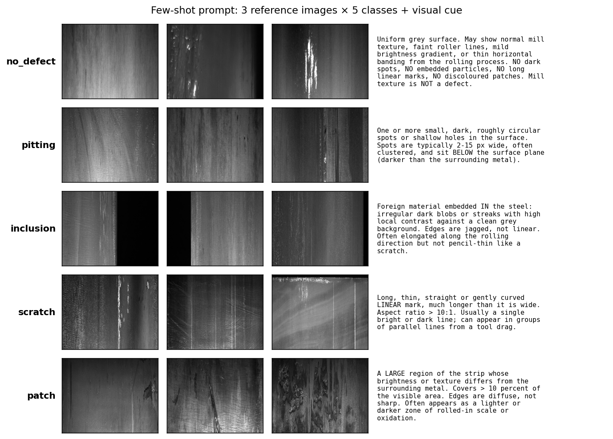

::: {.notes}

You can see that this is quite challenging - the no defect ones still have a lot of visual clutter, and the defects are often very subtle.

:::

## What are rolled-metal defects? — your turn {.uncounted}

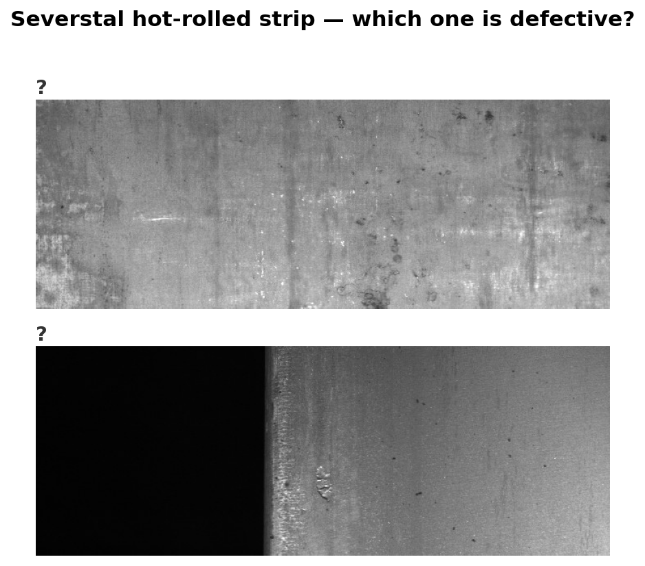{width="78%" fig-align="center"}

::: {.notes}
Pair A: a normal strip and a pitting defect. Let the audience commit before clicking through. The "normal" still has texture — that's the point: there's no clean baseline.
:::

## …and here is the pixel-level ground truth {.uncounted}

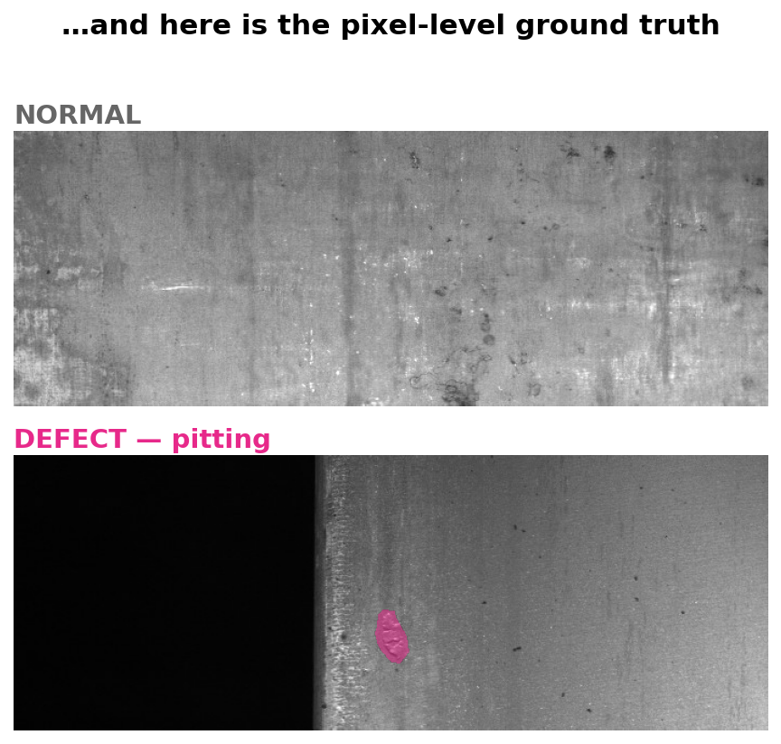{width="78%" fig-align="center"}

::: {.notes}
The defect is tiny — maybe 600 pixels in a 1600×256 image. Note how the "normal" still has visible texture. This is exactly why classical CV struggles: the signal-to-noise ratio at the pixel level is brutal.
:::

## Try another pair — both have defects {.uncounted}

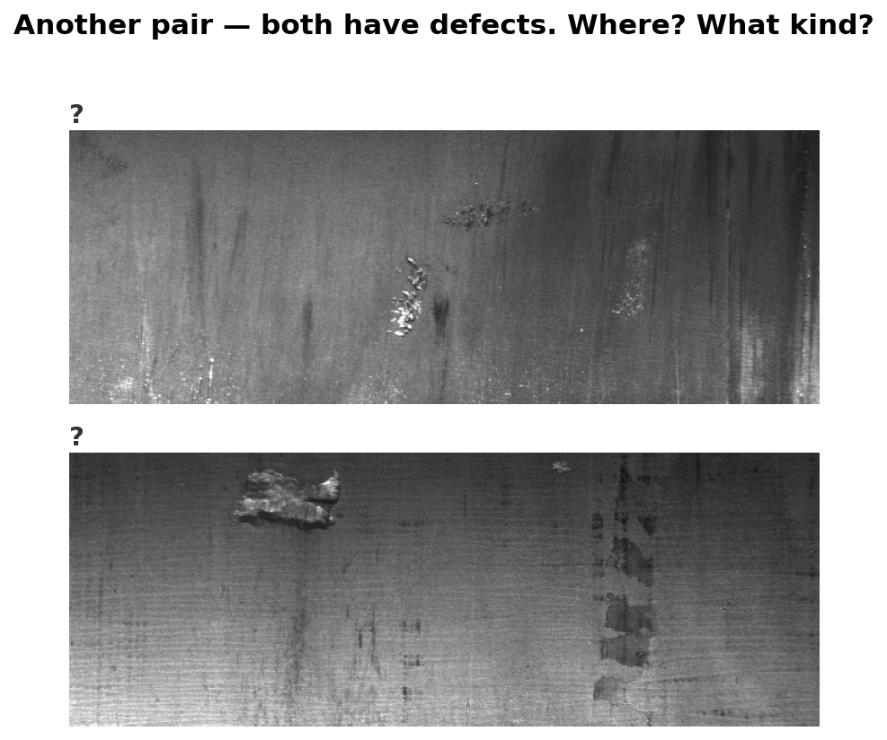{width="78%" fig-align="center"}

::: {.notes}
Pair B: a class-3 ("scratch") and a class-4 ("patch"). Audience usually spots *something* but rarely names the class — that's the multi-class problem on top of the binary one.
:::

## …annotated by a metallurgist, pixel by pixel {.uncounted}

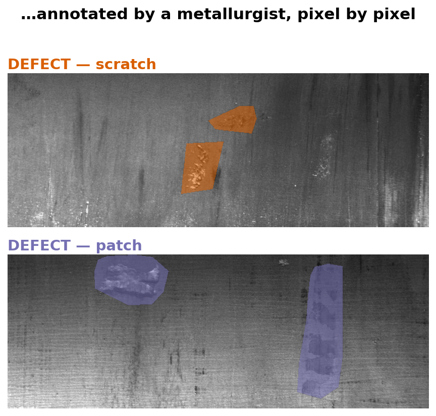{width="78%" fig-align="center"}

::: {.notes}
Every coloured pixel was painted by a human. ~12,500 of these images were annotated for the Kaggle Severstal challenge. That's the bill that classical CV asks you to pay every time the camera changes.
:::


# C. What do we know from AQ Group? {background-color="#1b9e77"}

## What is their setup??


::: {.notes}
We just don't know what the setup at the various AQ group factories is.
Ideally, we would have a team of engineers who have set up a high quality imaging camera system that is capable of capturing high resolution images of the rolled-metal as it is being produced, as in the top left quadrant of the image. They would also have a team of data annotators who have labeled a large dataset of images with the various types of defects that can occur, as in quadrants two and three. This would allow us to train a supervised learning model to detect the defects in real-time as the metal is being produced. I think this is unlikely to be the case, because if they had gone to all of the work of putting in the cameras and annotating the data, they probably would have already trained a model to do this, and celebrated the completion of a successful project, as in the bottom right quadrant of the image. So I think it's more likely that we will have to work with a less than ideal setup, which is something that we will have to prepare for.
:::

## We make some assumptions about the project spec

We will treat the problem as if they have 

- **no labelled data**, 

- but want us to as quickly as possible provide them with a system that **can identify defects** on the production line. 

Then in this demo, I choose 

- two datasets that have some similarities to what we might expect from AQ Group as training data 

- and use another dataset as a holdout set to test how well our models generalise to new domains.

- I collapse all the labels to a single binary "defect / no-defect" target, because we don't know what the defect taxonomy is at AQ Group.

So how do we go about this??

# D. Is computer vision a solved problem? {background-color="#1b9e77"}

## Yes — classical CV is a (mostly) solved problem!

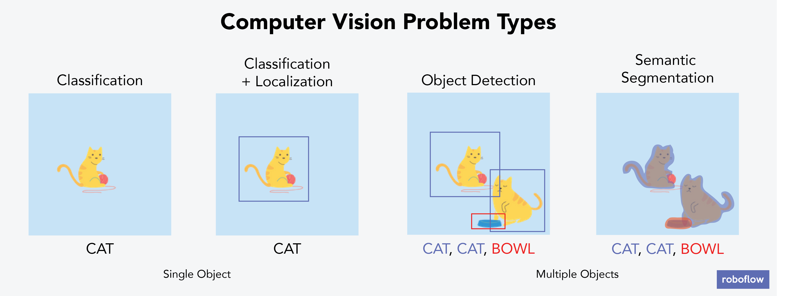{width="82%" fig-align="center"}

## The people who solved it {.uncounted}

::: {.columns}

::: {.column width="50%"}

{width="80%"}

:::

::: {.column width="50%"}

{width="100%"}

:::

:::

## …and the network that started it {.uncounted}

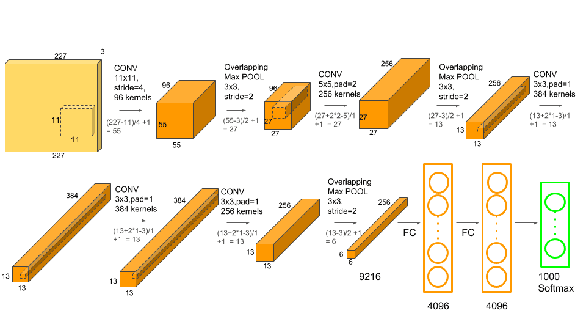{width="88%" fig-align="center"}

::: {.notes}

Talk about the progression in Computer vision, from Mnist to ImageNet to the present day. Talk about how resnet and yolo models have very fast inference, but need the images that they are trained on to be very similar to the ones that they predict on. They are good at identifying the patterns that they have seen in the training data, but they are not good at generalizing to new domains. This is a problem for AQ group, because we don't know what the domain of the images that we will be working with is. We might be working with images that are very different from the ones that we have seen in the training data, and this could lead to poor performance.
:::

# But the issue is when we change the domain… {background-color="#1b9e77"}

## Rolled metal defects are not objects the models are trained on

{width="92%" fig-align="center"}

::: {.notes}
The problem is generalization - these models are exceptionally good at identifying edges, lines, etc, but it needs to see examples of the objects it is trying to predict in our domain. COCO contains 80 everyday object categories built from photographs of the natural world. A rolled-metal surface defect — a pit, a scratch, a silk-spot — looks like nothing in that vocabulary. The model does not fail because it is a bad model; it fails because it has never been shown what a defect looks like. That is the annotation bottleneck in one image.
:::


## What has the model learned to see?

::: {.r-stack}
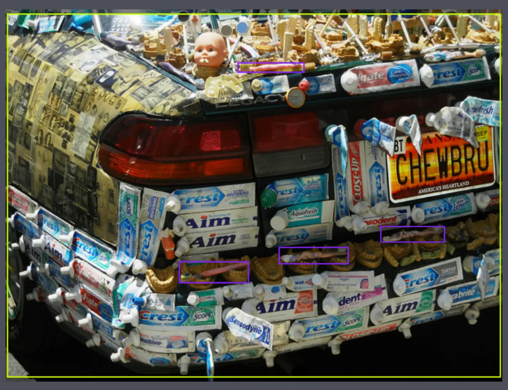{.fragment height="700"}

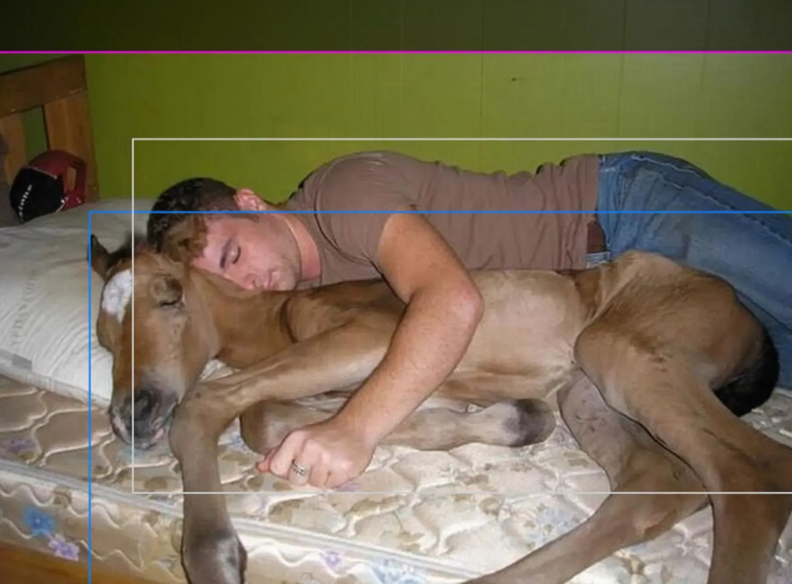{.fragment height="700"}

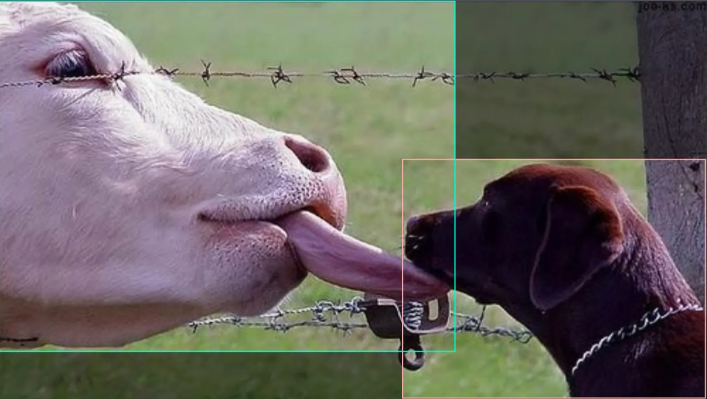{.fragment height="700"}

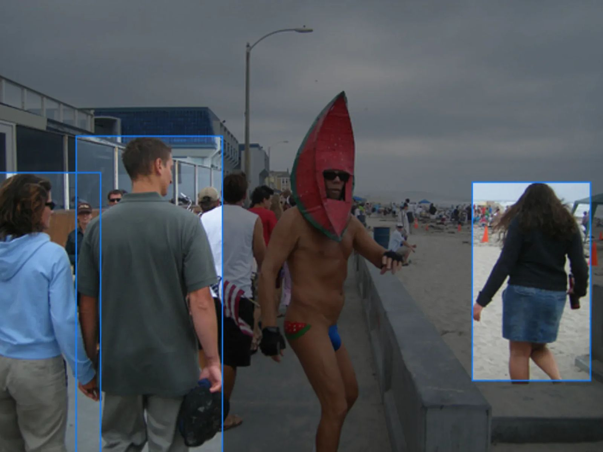{.fragment height="700"}

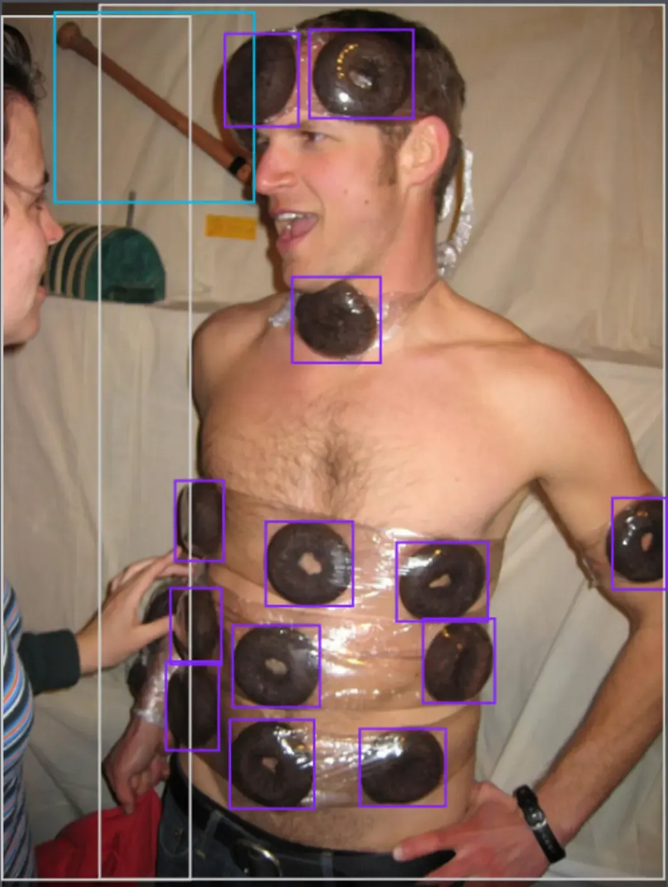{.fragment height="700"}
:::

## The annotation bottleneck

::: {.columns}

::: {.column width="55%"}

<video src="assets/videos/data_annotation.mp4" controls autoplay muted loop style="width:100%; border-radius:8px;"></video>

:::

::: {.column width="45%"}

**Classical CV runs on labels.**

Every time the camera moves, the lighting changes, or a new defect class shows up, the whole pipeline goes back to the annotator queue.

For AQ Group we don't yet know:

- which mill
- which camera, which lighting rig
- which defect taxonomy matters in production

So the safe bet is a system that can *start* without labels.

:::

:::

:::{.notes}

The problem is that we will have to spend a lot of time speaking to engineers and asking them to annotate data, and this is a bottleneck that we want to avoid. We want to be able to start working on the problem without having to wait for the annotations to be done, and this is where vision-language models come in.

:::

## Datasets at a glance {.smaller}{visibility="hidden"}

| Dataset           | Role     | Train  | Test  | Image size       | Native taxonomy                        |
|:------------------|:---------|-------:|------:|:-----------------|:---------------------------------------|
| **Severstal**     | Train    | 10,053 | 1,259 | 1600 × 256       | 4 classes (pit, scratch, patch, ridge) |
| **NEU-DET**       | Train    |  1,700 |   100 | 200 × 200        | 6 classes (crazing, inclusion, …)      |
| **KolektorSDD2**  | Holdout  |  2,332 | 1,004 | 230 × 630–1240   | 1 binary mask                          |

All labels collapsed to a single binary **defect / no-defect** target. The two TRAIN POOL datasets are what ResNet50 and YOLO11s see during training. KolektorSDD2 is the new mill — different camera, different lighting, different defect vocabulary — that the classical models have to generalise to.

::: {.notes}
The point of the table is to be concrete about what the models do and do not see. Severstal + NEU-DET ≈ 11 700 labelled images of two specific imaging setups. KolektorSDD2 is reserved as the held-out *domain*: same task ("is there a defect?"), totally different pixels. NEU-DET ships all-defect (no normals) — that's what a lot of real factory data looks like before anyone has bothered to annotate a clean baseline.
:::


## The domain-gap problem, visualised

::: {.columns}

::: {.column width="80%"}

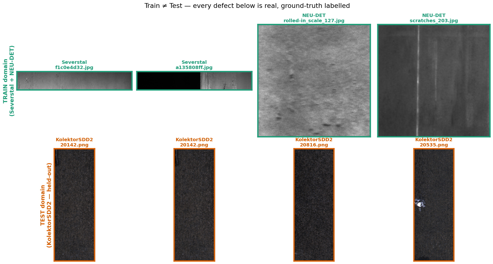{width="100%"}

:::

::: {.column width="20%"}

**Same task — "is this strip defective?" — wildly different pixels.**

:::

:::

::: {.notes}
This is the visceral "look-and-feel" of distribution shift. We didn't change the task — we changed the camera.

- Different sensors, illumination, exposure, magnification
- Different defect taxonomies (scratches vs silk-spots vs welding lines)
- Different aspect ratios (1600×256 vs 229×645)
- Different surface treatments

A classifier trained on the top row has never seen anything that looks like the bottom row.

:::


## Two classical workhorses

::: {.columns}

::: {.column width="50%"}

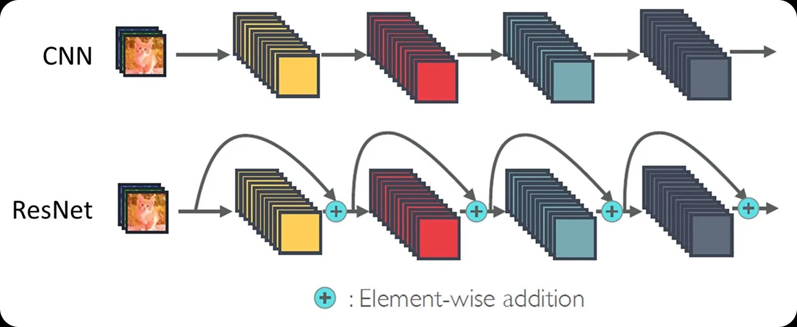{width="100%"}

:::

::: {.column width="50%"}

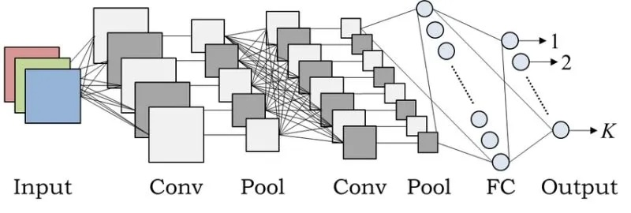{width="100%"}

:::

:::

::: {.notes}
Two architectures we'll lean on. ResNet50 is the canonical image classifier — convolutional backbone, pooled features, one sigmoid output. YOLO is the canonical real-time detector — same kind of backbone, but the head predicts a grid of bounding boxes with class scores. ResNet gives us "is this strip defective?". YOLO gives us "and here's where, with a box per instance". Both are pre-trained on ImageNet / COCO and then fine-tuned on Severstal + NEU-DET.
:::


## What the baseline ResNet actually predicts{visibility="hidden"}

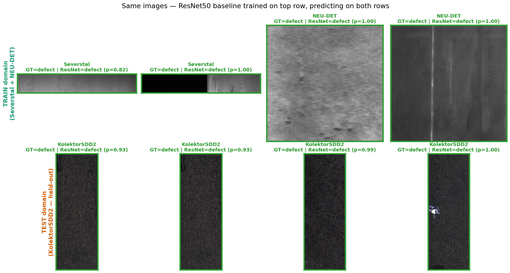{width="78%" fig-align="center"}

::: {.notes}
Calibration is broken too — high confidence on wrong calls. This sets up Grad-CAM and the bake-off.
:::


## The VLM tells you *why* — not just what

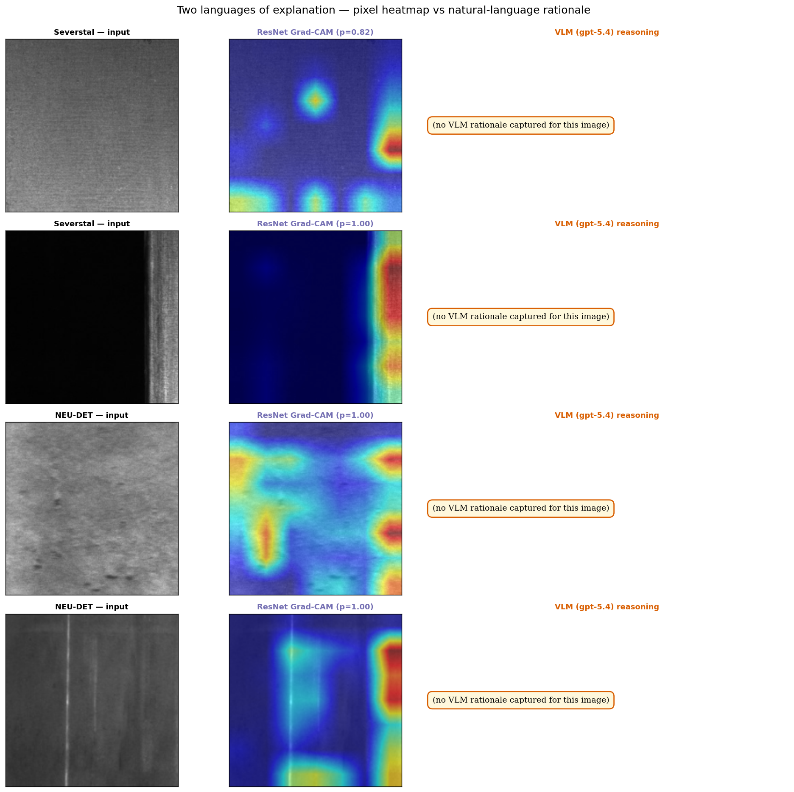{width="100%" fig-align="center"}

::: {.notes}
Row 1 (Severstal, normal): ResNet confidence is low (p̂=0.06) — correctly uncertain. The CAM lights up mid-strip texture. VLM correctly calls NORMAL and explains *why*: "darker vertical streaks are consistent with benign surface texture/illumination variation rather than a distinct localised manufacturing defect."

Row 2 (KolektorSDD2, defect): ResNet says p̂=0.11 — confidently wrong. The CAM scatters attention at the bottom, nowhere near the actual scratch. VLM correctly calls DEFECT (conf 0.94) and explains: "a single bright diagonal linear mark on the left side is inconsistent with the surrounding texture … most plausibly caused by mechanical scratching."

Row 3 (Severstal, defect): ResNet gets it right (p̂=0.75) and CAM fires broadly. VLM also correct (conf 0.79): "a localized bright vertical mark near the center … most consistent with a mechanical scratch or roller contact mark."

The key contrast: the Grad-CAM tells an operator *where* the network looked; the VLM tells them *what it saw and why it matters*. Run with: `uv run python scripts/make_cam_vlm_slide.py`.
:::


## More labels won't save us

::: {.columns}

::: {.column width="60%"}

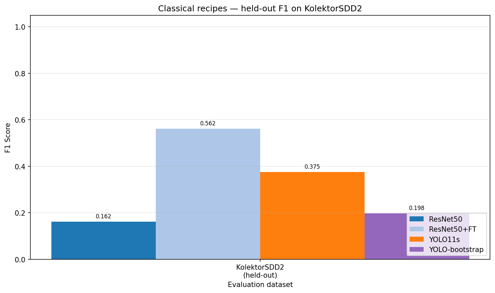{width="100%"}

:::

::: {.column width="40%"}

**No classical recipe gets us there.**

Fine-tuning on Kolektor helps — F1 climbs from 0.16 to 0.56 — but still leaves us far short of production-ready.

~11 700 labels in, and the ceiling is a *passable* model on one mill.

:::

:::

::: {.notes}
This slide earns the pivot to VLMs. We tried the obvious classical things — bigger model, fine-tune on a slice of the new domain, detection head (YOLO11s), self-labelling Severstal and re-training YOLO on those pseudo-labels. None of them clear the bar on KolektorSDD2. Fine-tuning on Kolektor lifts F1 3.5× but plateaus around 0.56. Numbers (held-out F1 on Kolektor):

- ResNet50: 0.16
- ResNet50+FT: 0.56
- YOLO11s: 0.38
- YOLO-bootstrap: 0.20

The figure is deliberately *all classical* — the VLM hasn't entered the story yet. Audience should leave this slide asking "what else could possibly help?". Source: `results/{resnet50,resnet50_kolektor_ft,yolo,yolo_bootstrap}/metrics.json`, rendered by `scripts/make_comparison_figures.py` (`f1_comparison_classical.png`).
:::


## A YOLO box says something a heatmap can't

{width="84%" fig-align="center"}

::: {.notes}
Qualitative companion to the scoreboard. The F1 numbers don't tell you *what each output looks like*. Walk the rows:

**Row 1 (Severstal, in-domain):** ResNet fires on the whole bright region (`p̂=1.00`) — useful as a yes/no, useless if you want to know *which* defect. YOLO drops four tight boxes on the actual scratches with per-instance confidence. That's a *work order* for an operator.

**Row 2 (Severstal, in-domain):** Same story — three crisp boxes vs one broad blob.

**Row 3 (Kolektor, OOD):** Both models break, but differently. ResNet says "no defect" (`p̂=0.11`) and the CAM is on irrelevant texture. YOLO does fire — two low-confidence boxes — but they're at the top, not on the actual scratch in the middle.

Neither is great on the OOD row. The point of the slide is **different output shape, same domain-gap problem** — bringing more classical machinery to bear doesn't close the gap, it just changes what "failure" looks like. Time to try something different.
:::


## Why are VLMs better at CV tasks now?

```{=html}
<style>
.vlm-timeline { width: 1450px; max-width: 100%; margin: 0 auto; background: #f4f7f9; border-radius: 12px; padding: 24px 24px; box-shadow: 0 8px 30px rgba(0,0,0,0.08); font-family: -apple-system, BlinkMacSystemFont, "Segoe UI", Roboto, sans-serif; box-sizing: border-box; font-size: 13px; }
.vlm-timeline * { box-sizing: border-box; }

  /* Timeline Horizontal Layout */
  .vlm-timeline .timeline-container {
    position: relative;
    width: 100%;
    height: 540px;
    display: flex;
    align-items: center;
    justify-content: space-between;
  }

  /* The central horizontal line */
  .vlm-timeline .timeline-line {
    position: absolute;
    top: 50%;
    left: 20px;
    right: 20px;
    height: 4px;
    background: #cbd5e1;
    transform: translateY(-50%);
    z-index: 1;
    border-radius: 2px;
  }

  /* Individual Node */
  .vlm-timeline .timeline-item {
    position: relative;
    flex: 1;
    display: flex;
    justify-content: center;
    height: 100%;
  }

  /* The dot on the line */
  .vlm-timeline .timeline-dot {
    position: absolute;
    top: 50%;
    left: 50%;
    transform: translate(-50%, -50%);
    width: 22px;
    height: 22px;
    border-radius: 50%;
    background: #fff;
    border: 6px solid #94a3b8;
    z-index: 3;
    box-shadow: 0 0 0 4px #f4f7f9;
  }

  /* Fusion Type Colors */
  .vlm-timeline .dot-none { border-color: #64748b; }
  .vlm-timeline .tag-none { background-color: #64748b; color: #fff; }

  .vlm-timeline .dot-late { border-color: #3b82f6; }
  .vlm-timeline .tag-late { background-color: #3b82f6; color: #fff; }

  .vlm-timeline .dot-early { border-color: #10b981; }
  .vlm-timeline .tag-early { background-color: #10b981; color: #fff; }

  /* Connecting stems */
  .vlm-timeline .timeline-item::before {
    content: '';
    position: absolute;
    left: 50%;
    width: 2px;
    height: 50px;
    background: #cbd5e1;
    transform: translateX(-50%);
    z-index: 2;
  }
  .vlm-timeline .timeline-item.top::before {
    bottom: 50%;
  }
  .vlm-timeline .timeline-item.bottom::before {
    top: 50%;
  }

  /* Content Box */
  .vlm-timeline .timeline-content {
    position: absolute;
    width: 200px;
    background: #fff;
    padding: 10px 12px;
    border-radius: 10px;
    box-shadow: 0 8px 20px rgba(0,0,0,0.05);
    border: 1px solid #e2e8f0;
    text-align: left;
    left: 50%;
    transform: translateX(-50%);
    z-index: 4;
  }

  /* Positioning top and bottom */
  .vlm-timeline .timeline-item.top .timeline-content {
    bottom: calc(50% + 50px);
  }
  .vlm-timeline .timeline-item.bottom .timeline-content {
    top: calc(50% + 50px);
  }

  /* Edge alignments to maintain bounds */
  .vlm-timeline .timeline-item:first-child .timeline-content { left: 0; transform: none; }
  .vlm-timeline .timeline-item:first-child::before { left: 20px; }
  .vlm-timeline .timeline-item:first-child .timeline-dot { left: 20px; }

  .vlm-timeline .timeline-item:last-child .timeline-content { left: auto; right: 0; transform: none; }
  .vlm-timeline .timeline-item:last-child::before { left: auto; right: 20px; transform: none; }
  .vlm-timeline .timeline-item:last-child .timeline-dot { left: auto; right: 20px; transform: translateY(-50%); }

  /* Typography */
  .vlm-timeline .timeline-date {
    font-size: 0.85em;
    color: #64748b;
    margin-bottom: 4px;
    font-weight: 700;
    text-transform: uppercase;
  }
  .vlm-timeline .timeline-title {
    margin: 0 0 6px 0;
    font-size: 1.25em;
    color: #0f172a;
  }
  .vlm-timeline .tag {
    display: inline-block;
    padding: 3px 8px;
    border-radius: 20px;
    font-size: 0.75em;
    font-weight: 700;
    margin-bottom: 8px;
  }
  .vlm-timeline .timeline-desc {
    line-height: 1.3;
    margin: 0;
    color: #475569;
    font-size: 0.85em;
  }
</style>

<div class="vlm-timeline">
  <div class="timeline-container">
      <div class="timeline-line"></div>
      
      <!-- GPT-3.5 -->
      <div class="timeline-item top">
        <div class="timeline-dot dot-none"></div>
        <div class="timeline-content">
          <div class="timeline-date">Nov 2022</div>
          <h2 class="timeline-title">GPT-3.5</h2>
          <span class="tag tag-none">No Fusion</span>
          <p class="timeline-desc">Launch of ChatGPT. Core engine handles text tokens exclusively.</p>
        </div>
      </div>

      <!-- GPT-4 Base -->
      <div class="timeline-item bottom">
        <div class="timeline-dot dot-none"></div>
        <div class="timeline-content">
          <div class="timeline-date">Mar 2023</div>
          <h2 class="timeline-title">GPT-4 (Base)</h2>
          <span class="tag tag-none">No Fusion</span>
          <p class="timeline-desc">Massive logical upgrade, but architecture remains text-only.</p>
        </div>
      </div>

      <!-- GPT-4V & Voice -->
      <div class="timeline-item top">
        <div class="timeline-dot dot-late"></div>
        <div class="timeline-content">
          <div class="timeline-date">Sep 2023</div>
          <h2 class="timeline-title">GPT-4V / Voice</h2>
          <span class="tag tag-late">Late Fusion</span>
          <p class="timeline-desc">Stitched pipeline. External vision encoders and audio transcribers translation layers.</p>
        </div>
      </div>

      <!-- GPT-4o -->
      <div class="timeline-item bottom">
        <div class="timeline-dot dot-early"></div>
        <div class="timeline-content">
          <div class="timeline-date">May 2024</div>
          <h2 class="timeline-title">GPT-4o</h2>
          <span class="tag tag-early">Early Fusion</span>
          <p class="timeline-desc">Unified architecture. Processes text, native sight, and live audio in one neural space.</p>
        </div>
      </div>

      <!-- GPT-4o mini -->
      <div class="timeline-item top">
        <div class="timeline-dot dot-early"></div>
        <div class="timeline-content">
          <div class="timeline-date">Jul 2024</div>
          <h2 class="timeline-title">GPT-4o mini</h2>
          <span class="tag tag-early">Early Fusion</span>
          <p class="timeline-desc">Streamlined omni variant maintaining native multimodal processing.</p>
        </div>
      </div>

      <!-- GPT-5 Family -->
      <div class="timeline-item bottom">
        <div class="timeline-dot dot-early"></div>
        <div class="timeline-content">
          <div class="timeline-date">2025+</div>
          <h2 class="timeline-title">GPT-5 Family</h2>
          <span class="tag tag-early">Early Fusion</span>
          <p class="timeline-desc">Scales early-fusion to native video generation and seamless token blending.</p>
        </div>
      </div>

  </div>
</div>
```

::: {.notes}

**Slide goal:** Highlight the fundamental architectural paradigm shift OpenAI went through in under 3 years.

- **GPT-3.5 & GPT-4 base** — traditional, blind LLMs. Text-in, text-out. No fusion: there were no other modalities to handle.
- **GPT-4V & classic Voice** — *late fusion*. Components stitched together; information is lost (tone of voice flattened to plain text; vision pre-filtered through a separate encoder). It's a pipeline bottleneck.
- **GPT-4o onwards** — *early fusion*. No translators or adapters: images and raw audio go straight into the core network alongside text. Enables human-level latency and native audio outputs.

:::

# E. How do Vision-Language Models see images?{background-color="#1b9e77"}

## Late Fusion

Train a Large Language Model on text, then add vision as a separate input channel with a translation layer.

```{=html}
<style>
        .vlm-late-host {
            background: #f4f7f9;
            color: #0f172a;
            font-family: -apple-system, BlinkMacSystemFont, "Segoe UI", Roboto, sans-serif;
            display: flex;
            justify-content: center;
            align-items: center;
            min-height: 640px;
            margin: 0 auto;
            max-width: 1100px;
            border-radius: 12px;
            padding: 28px 24px;
            box-shadow: 0 8px 30px rgba(0,0,0,0.08);
            box-sizing: border-box;
        }
        .vlm-late-host * { box-sizing: border-box; }

        .vlm-late-host .diagram-container {
            display: flex;
            flex-direction: column;
            align-items: center;
            width: 100%;
            max-width: 720px;
        }

        /* Card-style boxes */
        .vlm-late-host .box {
            background: #fff;
            border: 1px solid #e2e8f0;
            border-top: 4px solid #64748b;
            border-radius: 10px;
            padding: 12px 22px;
            text-align: center;
            font-weight: 700;
            color: #0f172a;
            box-shadow: 0 6px 16px rgba(15,23,42,0.06);
            letter-spacing: 0.3px;
            font-size: 1rem;
        }

        .vlm-late-host .box-subtext {
            display: block;
            font-size: 0.75rem;
            margin-top: 4px;
            font-weight: 400;
            color: #64748b;
            letter-spacing: 0;
        }

        /* Accent colours (matches timeline palette) */
        .vlm-late-host .cyan-theme  { border-top-color: #3b82f6; }
        .vlm-late-host .purple-theme{ border-top-color: #7570b3; }
        .vlm-late-host .orange-theme{ border-top-color: #d95f02; background: #fff7ed; }
        .vlm-late-host .white-theme { border-top-color: #94a3b8; }

        /* LLM hero box */
        .vlm-late-host .box.llm {
            width: 78%;
            padding: 18px;
            font-size: 1.4rem;
            margin: 14px 0;
        }

        /* Token chips */
        .vlm-late-host .token-group {
            display: flex;
            gap: 10px;
            justify-content: center;
            margin-bottom: 6px;
        }
        .vlm-late-host .token {
            width: 30px;
            height: 30px;
            border-radius: 6px;
            background: #fff;
            border: 1px solid #e2e8f0;
            box-shadow: 0 4px 10px rgba(15,23,42,0.05);
        }
        .vlm-late-host .token.cyan-theme  { background: #3b82f6; border-color: #3b82f6; }
        .vlm-late-host .token.purple-theme{ background: #7570b3; border-color: #7570b3; }

        /* Bottom input paths */
        .vlm-late-host .input-paths {
            display: flex;
            width: 100%;
            justify-content: center;
            gap: 60px;
            margin-top: 6px;
        }
        .vlm-late-host .path-column {
            display: flex;
            flex-direction: column;
            align-items: center;
            justify-content: flex-start;
            width: 45%;
        }

        /* Arrows: thin slate lines */
        .vlm-late-host .arrow-wrapper {
            display: flex;
            flex-direction: column;
            align-items: center;
            justify-content: center;
            margin: 4px 0;
        }
        .vlm-late-host .arrow-head {
            width: 0;
            height: 0;
            border-left: 6px solid transparent;
            border-right: 6px solid transparent;
            border-bottom: 8px solid #94a3b8;
        }
        .vlm-late-host .arrow-line {
            width: 2px;
            height: 28px;
            background: #cbd5e1;
        }
        .vlm-late-host .arrow-wrapper.purple .arrow-line { height: 240px; }
        .vlm-late-host .arrow-wrapper.white  .arrow-line { height: 20px; }
    </style>
<div class="vlm-late-host">


    <div class="diagram-container">
        <div class="box white-theme">Output Text</div>
        
        <div class="arrow-wrapper white">
            <div class="arrow-head"></div>
            <div class="arrow-line"></div>
        </div>

        <div class="box orange-theme llm">LLM</div>

        <div class="input-paths">
            <div class="path-column image-path">
                <div class="token-group">
                    <div class="token cyan-theme"></div>
                    <div class="token cyan-theme"></div>
                    <div class="token cyan-theme"></div>
                </div>

                <div class="arrow-wrapper cyan">
                    <div class="arrow-head"></div>
                    <div class="arrow-line"></div>
                </div>

                <div class="box cyan-theme">
                    Projection
                    <span class="box-subtext">(Feature Vectors)</span>
                </div>

                <div class="arrow-wrapper cyan">
                    <div class="arrow-head"></div>
                    <div class="arrow-line"></div>
                </div>

                <div class="box cyan-theme">Vision Encoder</div>

                <div class="arrow-wrapper cyan">
                    <div class="arrow-head"></div>
                    <div class="arrow-line"></div>
                </div>

                <div class="box cyan-theme">Image Input</div>
            </div>

            <div class="path-column text-path">
                <div class="token-group">
                    <div class="token purple-theme"></div>
                    <div class="token purple-theme"></div>
                    <div class="token purple-theme"></div>
                </div>

                <div class="arrow-wrapper purple">
                    <div class="arrow-head"></div>
                    <div class="arrow-line"></div>
                </div>

                <div class="box purple-theme">Text Prompt</div>
            </div>
        </div>
    </div>
</div>
```


:::{.notes}

In short, a CLIP-based LLM is like a monolingual English speaker relying on a highly skilled translator (the adapter) to understand French (images). A natively multimodal model is truly bilingual from birth, processing and generating text, images, and audio seamlessly with the same "brain."

:::

## Early Fusion

Train a Large Language Model on text and images together, with a shared internal representation.


```{=html}
<style>
        .vlm-early-host {
            background: #f4f7f9;
            color: #0f172a;
            font-family: -apple-system, BlinkMacSystemFont, "Segoe UI", Roboto, sans-serif;
            display: flex;
            justify-content: center;
            align-items: center;
            min-height: 640px;
            margin: 0 auto;
            max-width: 1100px;
            border-radius: 12px;
            padding: 28px 24px;
            box-shadow: 0 8px 30px rgba(0,0,0,0.08);
            box-sizing: border-box;
        }
        .vlm-early-host * { box-sizing: border-box; }

        .vlm-early-host .diagram-container {
            display: flex;
            flex-direction: column;
            align-items: center;
            width: 100%;
            max-width: 720px;
        }

        /* Card-style boxes */
        .vlm-early-host .box {
            background: #fff;
            border: 1px solid #e2e8f0;
            border-top: 4px solid #64748b;
            border-radius: 10px;
            padding: 12px 22px;
            text-align: center;
            font-weight: 700;
            color: #0f172a;
            box-shadow: 0 6px 16px rgba(15,23,42,0.06);
            letter-spacing: 0.3px;
            font-size: 1rem;
        }

        .vlm-early-host .cyan-theme { border-top-color: #10b981; }

        /* MM hero box */
        .vlm-early-host .box.mm {
            width: 78%;
            max-width: 460px;
            padding: 26px 20px;
            font-size: 2.4rem;
            margin: 12px 0;
            background: #ecfdf5;
        }

        /* Input/output rows */
        .vlm-early-host .inputs-row {
            display: flex;
            justify-content: space-between;
            align-items: flex-end;
            width: 85%;
            max-width: 460px;
            margin-bottom: 6px;
        }
        .vlm-early-host .input-item {
            display: flex;
            flex-direction: column;
            align-items: center;
            gap: 4px;
        }
        .vlm-early-host .text-label {
            font-size: 1.1rem;
            font-weight: 700;
            letter-spacing: 0.5px;
            color: #0f172a;
        }
        .vlm-early-host .outputs-row {
            display: flex;
            justify-content: space-around;
            width: 55%;
            max-width: 280px;
            margin-top: 6px;
            margin-bottom: 28px;
        }

        /* Arrows: thin slate lines pointing down */
        .vlm-early-host .arrow-wrapper {
            display: flex;
            flex-direction: column;
            align-items: center;
            justify-content: center;
        }
        .vlm-early-host .arrow-head.down {
            width: 0;
            height: 0;
            border-left: 7px solid transparent;
            border-right: 7px solid transparent;
            border-top: 9px solid #94a3b8;
            border-bottom: none;
        }
        .vlm-early-host .arrow-line {
            width: 2px;
            background: #cbd5e1;
        }
        .vlm-early-host .arrow-line.med { height: 36px; }

        /* Angled arrows */
        .vlm-early-host .rot-cw  { transform: rotate(25deg); }
        .vlm-early-host .rot-ccw { transform: rotate(-25deg); }
        .vlm-early-host .text-in  { transform: translateX(12px); }
        .vlm-early-host .video-in { transform: translateX(-12px); }
        .vlm-early-host .out-left  { transform: translateX(-12px); }
        .vlm-early-host .out-right { transform: translateX(12px); }

        /* Bottom title */
        .vlm-early-host .bottom-title {
            text-align: center;
            color: #0f172a;
            font-size: 1.5rem;
            font-weight: 700;
            letter-spacing: 0.5px;
            line-height: 1.25;
        }
        .vlm-early-host .bottom-title div:last-child {
            color: #64748b;
            font-weight: 500;
        }
    </style>
<div class="vlm-early-host">


    <div class="diagram-container">
        
        <div class="inputs-row">
            <div class="input-item text-in">
                <div class="text-label">Text</div>
                <div class="arrow-wrapper cyan rot-ccw">
                    <div class="arrow-line med"></div>
                    <div class="arrow-head down"></div>
                </div>
            </div>
            
            <div class="input-item">
                <div class="text-label">Image</div>
                <div class="arrow-wrapper cyan">
                    <div class="arrow-line med"></div>
                    <div class="arrow-head down"></div>
                </div>
            </div>
            
            <div class="input-item video-in">
                <div class="text-label">Video</div>
                <div class="arrow-wrapper cyan rot-cw">
                    <div class="arrow-line med"></div>
                    <div class="arrow-head down"></div>
                </div>
            </div>
        </div>

        <div class="box cyan-theme mm">MM</div>

        <div class="outputs-row">
            <div class="arrow-wrapper cyan rot-cw out-left">
                <div class="arrow-line med"></div>
                <div class="arrow-head down"></div>
            </div>
            <div class="arrow-wrapper cyan rot-ccw out-right">
                <div class="arrow-line med"></div>
                <div class="arrow-head down"></div>
            </div>
        </div>

        <div class="bottom-title">
            <div>Any-To-Any</div>
            <div>Generation</div>
        </div>

    </div>
</div>
```


:::{.notes}

In short, a CLIP-based LLM is like a monolingual English speaker relying on a highly skilled translator (the adapter) to understand French (images). A natively multimodal model is truly bilingual from birth, processing and generating text, images, and audio seamlessly with the same "brain."

:::

## Early Fusion shared embedding space

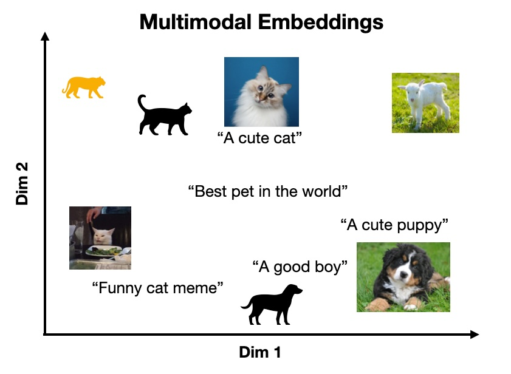


# F. Flagship VLM Bake-Off {background-color="#7570b3"}

## Same images, frontier models, zero training {.smaller}

::: {.columns}

::: {.column width="55%"}

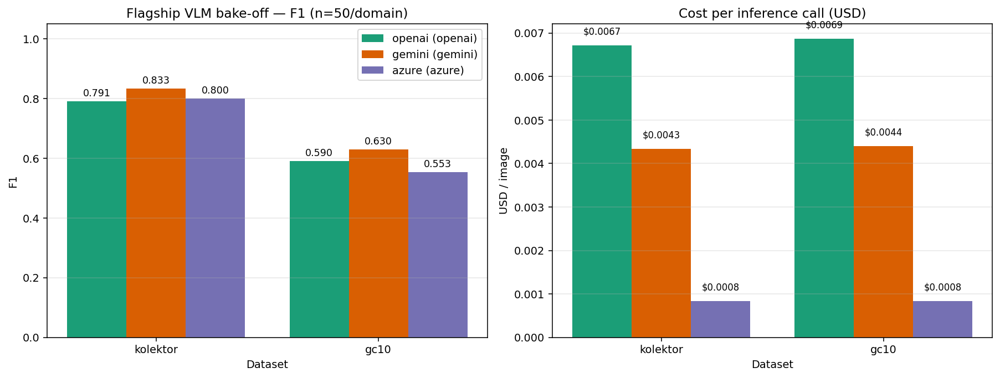{width="100%"}

:::

::: {.column width="45%"}

**Setup**

- 50 images (balanced) from held-out KolektorSDD2
- Identical CoT-with-JSON-schema prompt
- 3 providers via `src/vlm_clients.py`
- Costs logged to `results/cost_ledger.csv`, capped at `$50`

**Reading the chart**

- All three frontier models beat the supervised ResNet50 on Kolektor.
- Gemini 2.5 Pro tops the chart at F1 0.83.
- Azure mid-tier (gpt-4.1-mini) is the price–performance knee at F1 0.80 for ~10× less per call.

:::

:::

::: {.notes}
Source: results/vlm/flagship_summary_<latest>.json, rendered with scripts/make_flagship_bakeoff_figure.py.
:::


## Best VLM vs classical — KolektorSDD2 F1

::: {.columns}

::: {.column width="60%"}

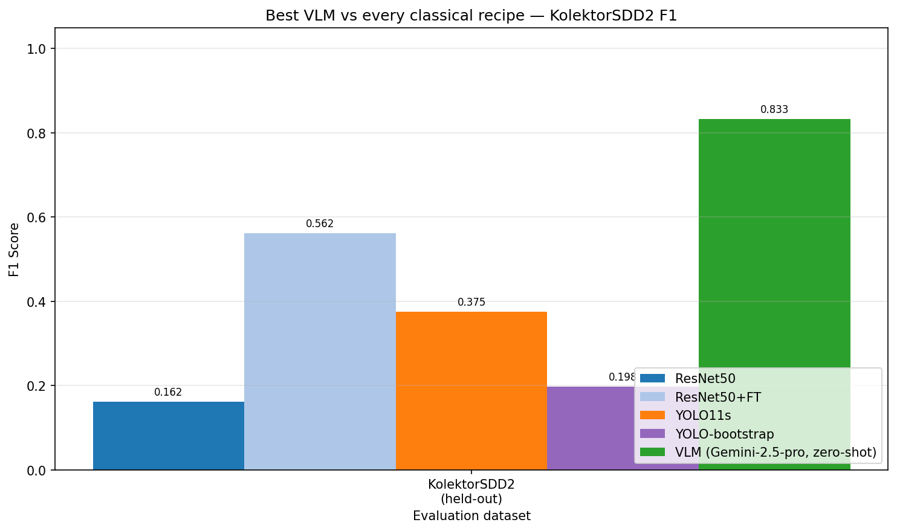{width="100%"}

:::

::: {.column width="40%"}

**The headline.**

- Best classical recipe (ResNet50 + Kolektor FT): **0.56**
- Best zero-shot VLM (Gemini 2.5 Pro): **0.83**

No labels on the new domain, no fine-tuning, no schema changes — just an API call with a prompt.

:::

:::

::: {.notes}
This is the punch-line of the bake-off. We poured ~11 700 labels and a fine-tune into the classical side; the VLM saw nothing of Kolektor before inference. Same metric, same images, very different ceiling. Rendered by scripts/make_comparison_figures.py (`f1_kolektor_vlm_vs_classical.png`), VLM number pulled from `results/vlm/flagship_summary_*.json`.
:::


# G. Prompt-tuning as gradient descent on words {background-color="#e7298a"}

## A structured-output teacher critiques a structured-output student {.smaller}

::: {.columns}

::: {.column width="55%"}

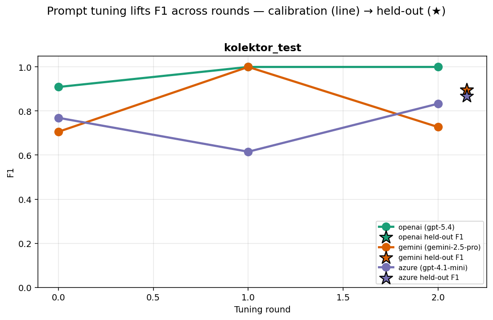{width="100%"}

:::

::: {.column width="45%"}

**The loop** (`scripts/prompt_tune_vlm.py`)

1. Score base prompt on a 12-image calibration set
2. Collect every disagreement with its parsed reasoning + attributes
3. Feed disagreements to **gpt-5.5** as a "domain prompt engineer"
4. Tuner emits JSON: `summary`, `common_mistakes[]`, `prompt_addendum`
5. Append the addendum, re-score, repeat

The tuner output is **schema-enforced** — strict JSON, no free-form prose. The addendum becomes a `# DOMAIN-SPECIFIC GUIDANCE` block prepended to the student's user prompt.

:::

:::

## The tuner's schema

``` {.python code-line-numbers="|3-6|8-15|17-22"}
TUNER_SCHEMA = {
    "type": "object",
    "properties": {
        "summary": {"type": "string"},
        "common_mistakes": {
            "type": "array",
            "minItems": 1,
            "items": {
                "type": "object",
                "properties": {
                    "pattern": {"type": "string"},
                    "fix": {"type": "string"},
                },
                "required": ["pattern", "fix"],
            },
        },
        "prompt_addendum": {
            "type": "string",
            "description": (
                "Markdown to append under '# DOMAIN-SPECIFIC GUIDANCE'. "
                "Explains the domain, what counts as a defect, and "
                "the visual heuristics that disambiguate the hard cases."
            ),
        },
    },
    "required": ["summary", "common_mistakes", "prompt_addendum"],
}
```

::: {.notes}
The "explain the domain" bit is what makes this generalise. We're not just patching mistakes — the tuner has to teach the student what a hot-rolled steel strip *is*, what counts as a scratch vs. a silk spot, why oil residue isn't a defect, etc.
:::


# H. Two languages of explanation {background-color="#66a61e"}

## Grad-CAM points. The VLM tells you why.

{width="88%" fig-align="center"}

::: {.notes}
This is the slide that justifies pairing them. Grad-CAM = *where*. VLM rationale = *what & why*. Walk through each row: the normal Severstal is correctly called by both (the VLM volunteers "benign longitudinal texture"). The Kolektor scratch is missed by the ResNet (p=0.11, CAM points at the edges) but caught by GPT-5.4 with a clean diagnosis. The Severstal row shows both flagging it as a defect, but Grad-CAM gives you a blob and the VLM gives you "localised bright vertical mark, mechanical scratch or roller contact." Last row is the honest failure: a partial-occlusion frame where the ResNet fires on the bright edge and the VLM declines — and tells you it's declining because "much of the frame is dominated by a large geometric edge/occlusion." For a process engineer triaging a flagged image, the second column is what closes the loop.
:::


# I. The economics: when does a VLM pay for itself? {background-color="#e6ab02"}

## How fast is each model on one image?

::: {.panel-tabset}

### Log scale

{width="86%" fig-align="center"}

### Linear scale

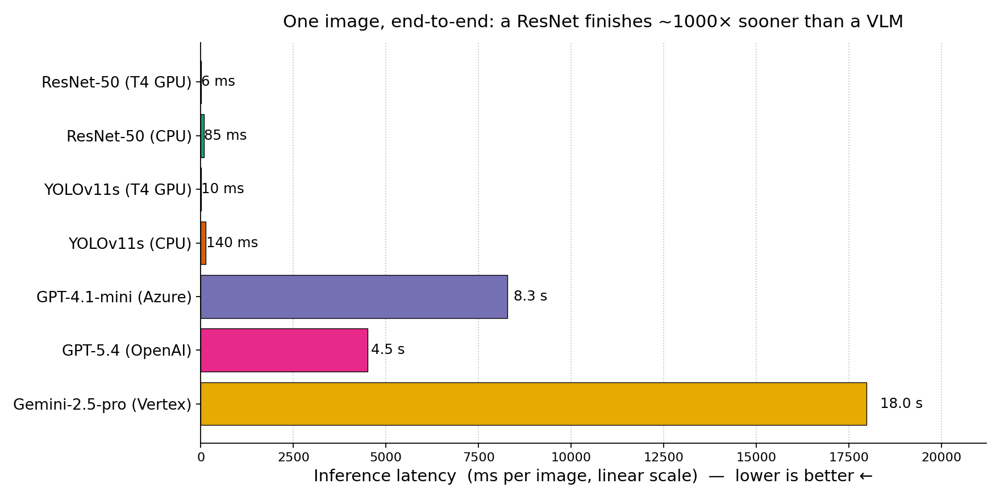{width="86%" fig-align="center"}

:::

::: {.notes}
This is the latency reality check. A T4-served ResNet handles an image in ~6 ms — that's ~160 images per second per GPU. The cheapest VLM in our bake-off (GPT-4.1-mini on Azure) takes ~3 seconds; Gemini-2.5-pro takes ~17. That's three to four orders of magnitude. A 60 frames-per-second inspection line is fine for the classical model and impossible for the VLM. The point of the next slide isn't to say VLMs are bad — it's to say: that latency comes from somewhere, and someone has to pay for it. Flip to the linear tab to make the scale gap visceral.
:::

## …and what does each call actually cost?

::: {.panel-tabset}

### Log scale

{width="86%" fig-align="center"}

### Linear scale

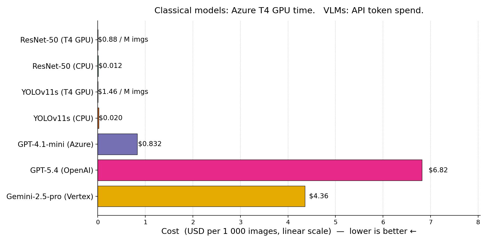{width="86%" fig-align="center"}

:::

::: {.notes}
The latency gap shows up almost 1:1 as a cost gap. Running ResNet on a rented T4 costs **fractions of a cent per thousand images** — most of the bill is the VM, not the compute. Calling Gemini-2.5-pro on the same 1 000 images costs about **$4.35** — roughly 5 000× more. GPT-4.1-mini sits in between at ~$0.83. So the choice isn't "smart vs dumb model" — it's "is the marginal accuracy from the VLM worth 4 to 5 orders of magnitude of cost?" Which sets up the break-even curve on the next slide.
:::

## One-off labelling + classical inference vs per-image VLM {.smaller}

::: {.columns}

::: {.column width="60%"}

{width="100%"}

:::

::: {.column width="40%"}

**Three label-cost worlds**

- **$0.05 / label** — in-house GPU-side annotators
- **$0.20 / label** — offshore crowd workers
- **$0.50 / label** — expert metallurgist sign-off

**Break-even images processed** (VLM-only vs label-once-then-classical):

- $0.05/label → ~26k images
- $0.20/label → ~104k images
- $0.50/label → ~261k images

A line running 24/7 hits 26k images in **hours**. The hybrid (YOLO → escalate 30% to VLM) buys back another 3×.

:::

:::

::: {.notes}
Numbers from scripts/make_cost_tradeoff_figure.py, sourcing per-call VLM cost from results/vlm/flagship_summary_*.json.
:::

## Does the student ever catch the teacher? {.smaller}

::: {.columns}

::: {.column width="65%"}

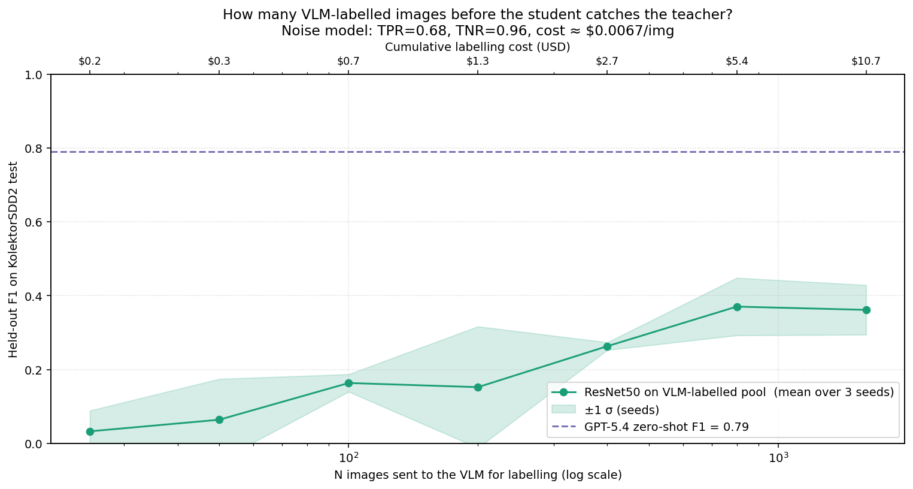{width="100%"}

:::

::: {.column width="35%"}

**Setup** (`scripts/labelling_curve.py`)

- Pool: Kolektor train (~2 300 images, ~10 % defective)
- Labels: VLM pseudo-labels with measured noise (TPR=0.68, TNR=0.96)
- 3 seeds per N — no class balancing
- 6 epochs, AdamW, ResNet50

**Reading the chart**

- At N ≤ 1 600, the student has not caught the teacher (F1 peaks ~0.37 vs 0.79).
- The gap signals that **more labels** and/or a cleaner label budget would be needed.
- The dollar axis makes the trade-off concrete: $10.74 of labelling still falls short.

:::

:::

::: {.notes}
The student (ResNet50) never catches the teacher (GPT-5.4 zero-shot) within the 1 600-image budget tested. This is an honest result — the teacher is very good and the labels are noisy. The practical implication is that you need either more images, better labels, or a fine-tuned VLM starting point before the classical model matches.
:::


# J. The takeaway {background-color="#a6761d"}

## Use VLMs to teach classical CV. Don't put them in the hot loop. {.smaller}

::: {.columns}

::: {.column width="50%"}

**What we showed**

1. Classical CV fails under realistic domain shift — and Grad-CAM tells you why.
2. Frontier VLMs generalise zero-shot to unseen mills and defect taxonomies.
3. A prompt-tuning loop, with a structured-output teacher, moves F1 measurably on a 12-image calibration budget.
4. VLMs and Grad-CAM give complementary explanations — *where* and *why*.
5. At line-rate volumes, the break-even versus paid labelling lands in hours, not months.

:::

::: {.column width="50%"}

**The recipe for AQ Group**

- **Day 1** — drop a VLM in shadow mode behind the existing camera. Zero labels needed.
- **Week 1** — harvest the VLM's pseudo-labels. Tune the prompt against your disagreements.
- **Week 2** — train a small ResNet / YOLO on the pseudo-labels. Put *that* in the hot loop.
- **Ongoing** — escalate the bottom-30%-confidence frames back to the VLM. Re-train weekly.

The VLM is the **teacher and the safety net**, not the production classifier.

:::

:::

::: {.notes}
This is the punchline. Everything before this slide is evidence; this slide is the recommendation.
:::
